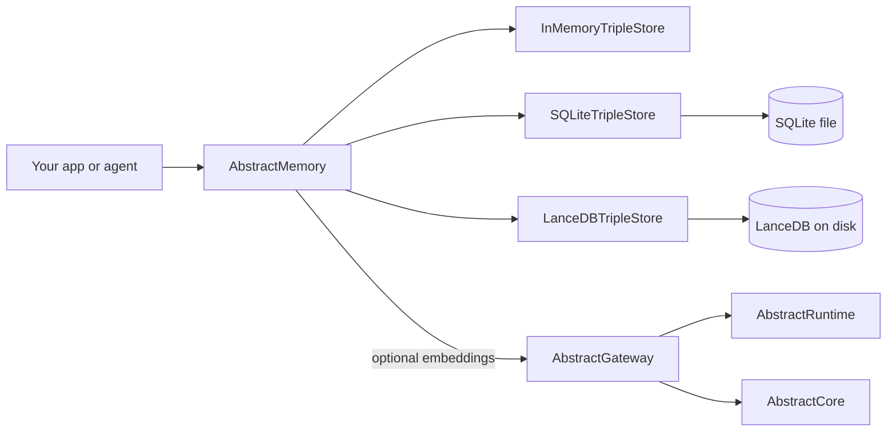

# AbstractMemory (early / pre-1.0)

AbstractMemory is a small Python library for **append-only, temporal, provenance-aware triple assertions** with **deterministic structured queries** and optional **vector/semantic retrieval**.

## Status
- This package is early (pre-1.0): the API is intentionally small, and details may evolve.
- Current repo version: `0.2.4` (see [`pyproject.toml`](pyproject.toml)).
- Implemented today (public API): `TripleAssertion`, `TripleQuery`, `TripleStore`, `InMemoryTripleStore`, `SQLiteTripleStore`, `LanceDBTripleStore`, `TextEmbedder`, `AbstractGatewayTextEmbedder`.
  - Source of truth for exports: [`src/abstractmemory/__init__.py`](src/abstractmemory/__init__.py)
- Requires Python 3.10+ (see [`pyproject.toml`](pyproject.toml))
- Release-channel note: this checkout is the source of truth for this documentation. As of 2026-05-05, PyPI's `AbstractMemory 0.2.3` has a different source layout from this repository and `origin` only has tags through `v0.2.2`; treat that mismatch as release drift until a maintainer republishes/tags from this repo.

## Ecosystem (AbstractFramework)

AbstractMemory is part of the **AbstractFramework** ecosystem:
- It stores and retrieves durable “memory” as append-only triples (this package).
- It can *optionally* call an **AbstractGateway** embeddings endpoint for semantic retrieval via `AbstractGatewayTextEmbedder` (no direct AbstractCore/AbstractRuntime dependency).

Evidence:
- No direct dependency on AbstractCore/AbstractRuntime: [`pyproject.toml`](pyproject.toml)
- Gateway adapter implementation: [`src/abstractmemory/embeddings.py`](src/abstractmemory/embeddings.py)



Related projects:
- AbstractFramework: `https://github.com/lpalbou/AbstractFramework`
- AbstractCore: `https://github.com/lpalbou/abstractcore`
- AbstractRuntime: `https://github.com/lpalbou/abstractruntime`

## Install

From source (recommended inside the AbstractFramework monorepo):

```bash
python -m pip install -e .
```

Optional persistent backend + vector search:

```bash
python -m pip install -e ".[lancedb]"
```

PyPI (packaged release):

```bash
python -m pip install AbstractMemory
python -m pip install "AbstractMemory[lancedb]"
```

Framework hardware profile aliases are also available:
`AbstractMemory[apple]` and `AbstractMemory[gpu]` are no-op compatibility
extras; `AbstractMemory[all-apple]` and `AbstractMemory[all-gpu]` install the
LanceDB backend for durable vector-capable recall.

Notes:
- The distribution name is `AbstractMemory` (pip is case-insensitive). The import name is `abstractmemory`.
- PyPI releases may not match this repository checkout exactly; see the release-channel note above.

## Quick example

```python
from abstractmemory import InMemoryTripleStore, TripleAssertion, TripleQuery

store = InMemoryTripleStore()
store.add(
    [
        TripleAssertion(
            subject="Scrooge",
            predicate="related_to",
            object="Christmas",
            scope="session",
            owner_id="sess-1",
            provenance={"span_id": "span_123"},
        )
    ]
)

hits = store.query(TripleQuery(subject="scrooge", scope="session", owner_id="sess-1"))
assert hits[0].object == "christmas"  # terms are canonicalized (trim + lowercase)
```

## Documentation

- Getting started: [`docs/getting-started.md`](docs/getting-started.md)
- FAQ: [`docs/faq.md`](docs/faq.md)
- Architecture (with diagrams): [`docs/architecture.md`](docs/architecture.md)
- Stores/backends: [`docs/stores.md`](docs/stores.md)
- API reference: [`docs/api.md`](docs/api.md)
- Development: [`docs/development.md`](docs/development.md)

## Project

- Changelog: [`CHANGELOG.md`](CHANGELOG.md)
- Contributing: [`CONTRIBUTING.md`](CONTRIBUTING.md)
- Security: [`SECURITY.md`](SECURITY.md)
- License: [`LICENSE`](LICENSE)
- Acknowledgments: [`ACKNOWLEDGMENTS.md`](ACKNOWLEDGMENTS.md)

## Design principles (v0)

- **Triples-first** representation with temporal fields (`observed_at`, `valid_from`, `valid_until`).
  - Implemented in `TripleAssertion`: [`src/abstractmemory/models.py`](src/abstractmemory/models.py)
- **Append-only**: represent updates by adding a new assertion with fresh provenance.
  - Implemented by all stores: [`src/abstractmemory/in_memory_store.py`](src/abstractmemory/in_memory_store.py), [`src/abstractmemory/sqlite_store.py`](src/abstractmemory/sqlite_store.py), [`src/abstractmemory/lancedb_store.py`](src/abstractmemory/lancedb_store.py)
- **No direct AbstractCore dependency**: embeddings can be obtained via an AbstractGateway HTTP API.
  - Implemented by `AbstractGatewayTextEmbedder`: [`src/abstractmemory/embeddings.py`](src/abstractmemory/embeddings.py)
