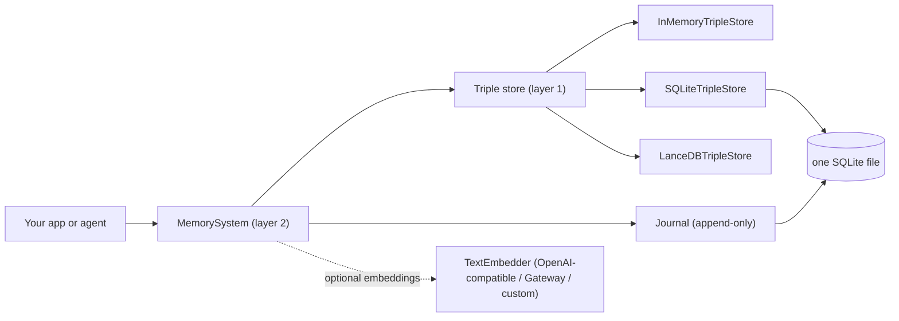

# AbstractMemory

AbstractMemory is a Python library for durable, append-only agent memory. It provides two layers:

- **Layer 1 — triple truth**: append-only, temporal, provenance-aware triple assertions with deterministic structured queries and optional vector/semantic retrieval, over in-memory, SQLite, or LanceDB backends.
- **Layer 2 — the memory system**: a `MemorySystem` facade that turns those triples plus an append-only journal into a usage-weighted memory graph: typed record formation, stimulus-driven reconstruction (working memory that emerges from use), attention and decay, identity cores for long-lived entities, valence/gradation (how experience felt), diary conventions, sleep/consolidation, and a replay stream for observability.

Storage never decays and nothing is ever deleted; only retrieval strength changes. Reads are pure — rendering a memory does not strengthen it; only committed use does.

## Status

- Pre-1.0: the API is versioned and tested, and details may still evolve. The current version is in [`pyproject.toml`](pyproject.toml).
- The authoritative export list is [`src/abstractmemory/__init__.py`](src/abstractmemory/__init__.py); [`docs/api.md`](docs/api.md) documents it.
- Requires Python 3.10+.

## Ecosystem (AbstractFramework)

AbstractMemory is a component of the **AbstractFramework** ecosystem. It has no dependency on AbstractCore or AbstractRuntime; embeddings for semantic retrieval can come from any OpenAI-compatible `/embeddings` endpoint (`OpenAICompatTextEmbedder`), from an AbstractGateway deployment (`AbstractGatewayTextEmbedder`), or from your own `TextEmbedder` implementation.


```mermaid
flowchart LR
  APP["Your app or agent"] --> MS["MemorySystem (layer 2)"]
  MS --> ST["Triple store (layer 1)"]
  MS --> J["Journal (append-only)"]
  ST --> IM["InMemoryTripleStore"]
  ST --> SQL["SQLiteTripleStore"]
  ST --> LDB["LanceDBTripleStore"]
  SQL --> F[("one SQLite file")]
  J --> F
  MS -. "optional embeddings" .-> E["TextEmbedder (OpenAI-compatible / Gateway / custom)"]
```

Related projects:

- AbstractFramework: `https://github.com/lpalbou/abstractframework`
- AbstractCore: `https://github.com/lpalbou/abstractcore`
- AbstractRuntime: `https://github.com/lpalbou/abstractruntime`

## Install

From source (recommended inside the AbstractFramework monorepo):

```bash
python -m pip install -e .
```

Optional LanceDB backend:

```bash
python -m pip install -e ".[lancedb]"
```

PyPI (packaged release):

```bash
python -m pip install AbstractMemory
python -m pip install "AbstractMemory[lancedb]"
```

The distribution name is `AbstractMemory` (pip is case-insensitive); the import name is `abstractmemory`. The `[apple]`/`[gpu]` extras are no-op compatibility aliases; `[all]`, `[all-apple]`, and `[all-gpu]` install the LanceDB backend.

## Quick example — layer 1 (triples)

```python
from abstractmemory import InMemoryTripleStore, TripleAssertion, TripleQuery

store = InMemoryTripleStore()
store.add([
    TripleAssertion(
        subject="Scrooge",
        predicate="related_to",
        object="Christmas",
        scope="session",
        owner_id="sess-1",
        provenance={"span_id": "span_123"},
    )
])

hits = store.query(TripleQuery(subject="scrooge", scope="session", owner_id="sess-1"))
assert hits[0].object == "christmas"      # terms are canonicalized (trim + lowercase)
assert hits[0].assertion_id is not None   # stores stamp read-side identity on results
```

## Quick example — layer 2 (the memory system)

```python
from abstractmemory import (
    MemorySystem, MemoryRecordInput, SQLiteTripleStore, SQLiteJournal, Stimulus,
)

store = SQLiteTripleStore("memory.sqlite3")
journal = SQLiteJournal("memory.sqlite3")   # sidecar tables in the same file
system = MemorySystem(store=store, journal=journal)

# Form a typed record (idempotent by key; forming is not using).
[record_id] = system.remember_many(
    [MemoryRecordInput(kind="episode", title="Pool outage",
                       digest="The connection pool saturated at noon.",
                       keywords=("pool", "outage"))],
    scope="session", owner_id="s1", idempotency_key="turn-1",
)

# Reconstruct working memory for a cue (pure read), then commit what you used.
result = system.reconstruct(Stimulus(cue_text="pool outage"), scopes=[("session", "s1")])
system.commit_selection(result.trace_id, [h.record_id for h in result.handles[:2]])
```

## Documentation

- Getting started: [`docs/getting-started.md`](docs/getting-started.md)
- Architecture: [`docs/architecture.md`](docs/architecture.md)
- The memory system (cognitive model): [`docs/memory-system.md`](docs/memory-system.md)
- API reference: [`docs/api.md`](docs/api.md)
- Stores/backends: [`docs/stores.md`](docs/stores.md)
- Operator guide (entity homes): [`docs/operator.md`](docs/operator.md)
- FAQ: [`docs/faq.md`](docs/faq.md)
- Development: [`docs/development.md`](docs/development.md)

## Project

- Changelog: [`CHANGELOG.md`](CHANGELOG.md)
- Contributing: [`CONTRIBUTING.md`](CONTRIBUTING.md)
- Security: [`SECURITY.md`](SECURITY.md)
- License: [`LICENSE`](LICENSE)
- Acknowledgments: [`ACKNOWLEDGMENTS.md`](ACKNOWLEDGMENTS.md)

## Design principles

- **Append-only, no deletion**: updates are new assertions; belief revision is closure records (retract/supersede); forgetting is decay of retrieval strength plus closures and silencing — the substrate is lossless.
- **Reads are pure**: reconstruction, inspection, replay, and the entity card deposit nothing. `commit_selection` is the only strengthening path.
- **One seq axis**: the journal assigns a monotonic `seq` to every record; any past state is reproducible by anchoring reads at `as_of`.
- **Works-or-loud**: degraded paths are labeled `#FALLBACK` in result warnings; invalid inputs raise actionable errors instead of silently meaning something else.
- **No heavy dependencies**: SQLite persistence and vector scoring use the standard library; LanceDB and embedders are optional.
