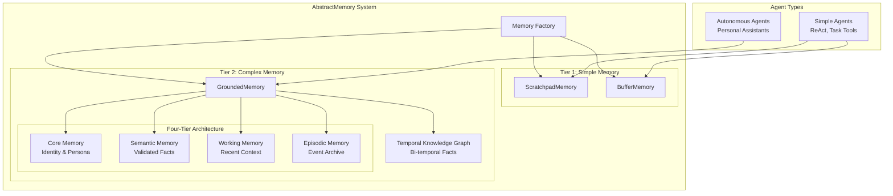
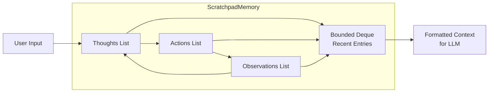
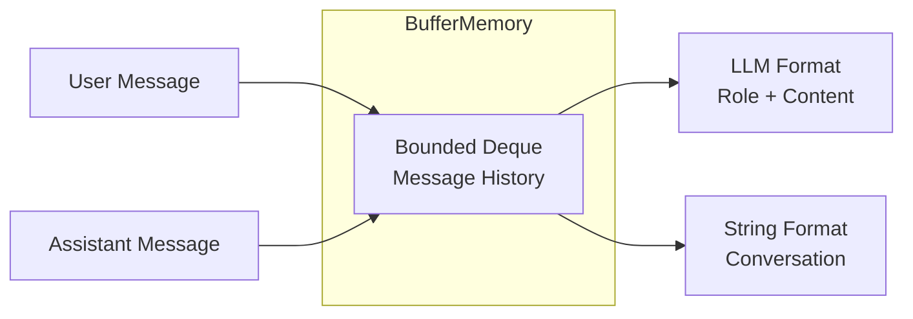
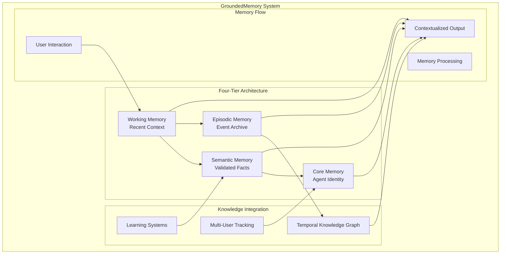
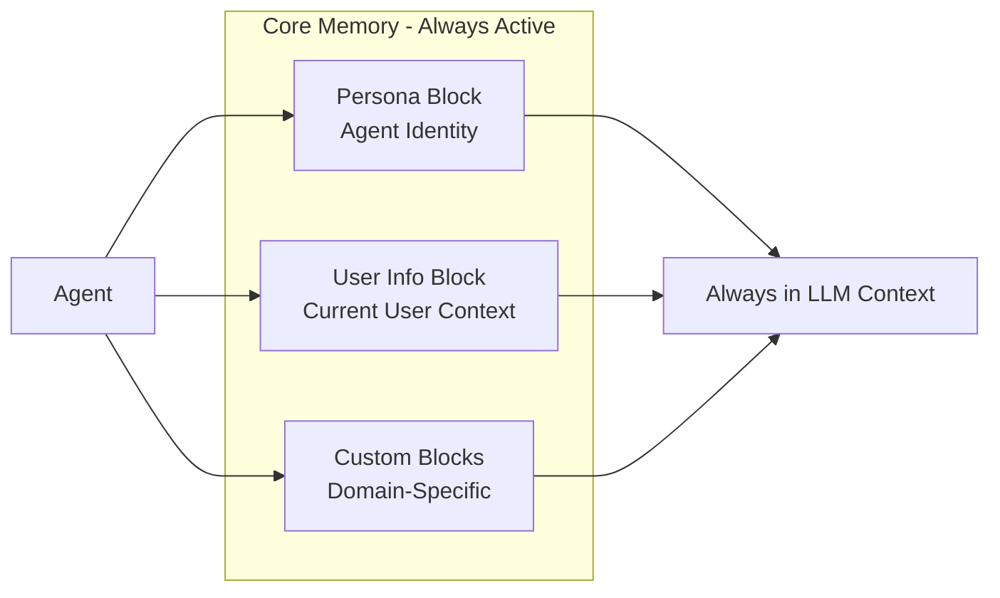
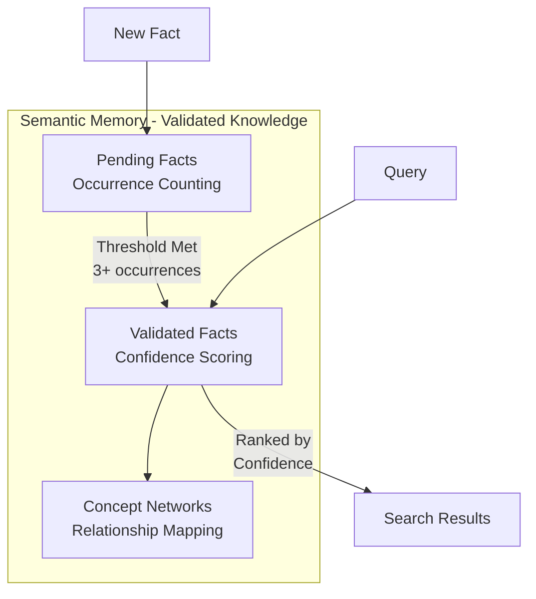
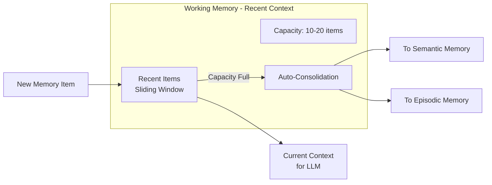
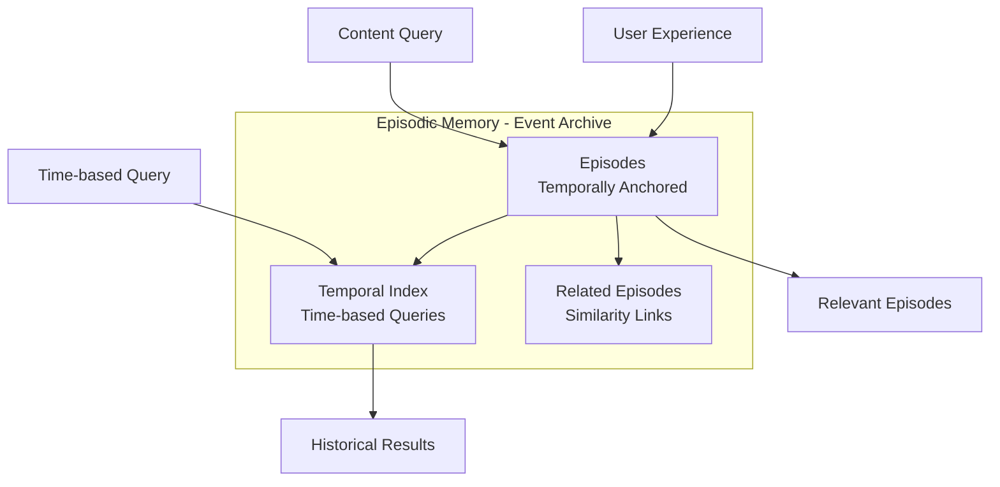
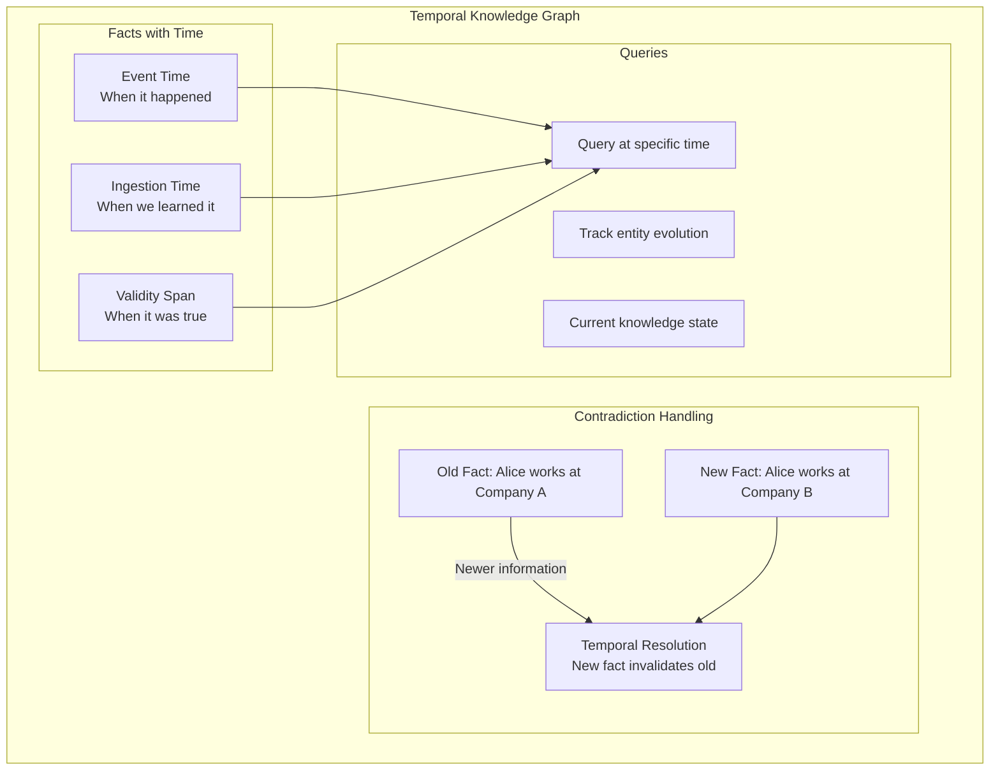
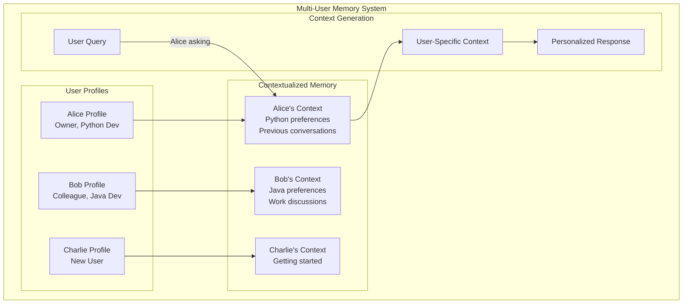

# AbstractMemory Architecture

This document provides a comprehensive overview of AbstractMemory's architecture, design principles, and internal workings.

## 🏗️ System Overview

AbstractMemory implements a **two-tier memory strategy** that matches memory complexity to agent purpose, avoiding over-engineering while providing sophisticated capabilities when needed.



## 🎯 Design Principles

### 1. Purpose-Driven Complexity
Memory sophistication matches agent requirements:

```python
# Simple agent = Simple memory
react_memory = create_memory("scratchpad")  # Lightweight, efficient

# Complex agent = Complex memory
autonomous_memory = create_memory("grounded")  # Full capabilities
```

### 2. No Over-Engineering
Simple agents don't pay the cost of unused features:

```python
# ReAct agent gets ONLY what it needs
scratchpad.add_thought("...")      # ✅ Essential for ReAct
scratchpad.add_action("...")       # ✅ Essential for ReAct
scratchpad.add_observation("...")  # ✅ Essential for ReAct

# No unused complexity
# ❌ scratchpad.set_current_user()  # Not available
# ❌ scratchpad.temporal_queries()  # Not available
```

### 3. State-of-the-Art Research Foundation

Built on proven memory architectures:

- **MemGPT/Letta**: Self-editing core memory with persona blocks
- **Zep/Graphiti**: Bi-temporal knowledge graphs with contradiction handling
- **Temporal Grounding**: WHO (relational) + WHEN (temporal) + WHERE (spatial)

## 📦 Component Architecture

### Core Interfaces

All memory components implement consistent interfaces:

```python
# Base memory item structure
@dataclass
class MemoryItem:
    content: Any                 # The actual content
    event_time: datetime        # When it happened
    ingestion_time: datetime    # When we learned about it
    confidence: float = 1.0     # How confident we are
    metadata: Dict[str, Any]    # Additional context

# Memory component interface
class IMemoryComponent(ABC):
    def add(self, item: MemoryItem) -> str: ...
    def retrieve(self, query: str, limit: int = 10) -> List[MemoryItem]: ...
    def consolidate(self) -> int: ...
```

### Temporal Grounding

Multi-dimensional anchoring for autonomous agents:

```python
@dataclass
class GroundingAnchor:
    # Temporal grounding (WHEN)
    event_time: datetime        # When it actually happened
    ingestion_time: datetime    # When we learned about it
    validity_span: TemporalSpan # When it was/is valid

    # Relational grounding (WHO)
    relational: RelationalContext  # User, agent, relationship context

    # Additional grounding (WHERE, confidence, source)
    confidence: float = 1.0
    source: Optional[str] = None
    location: Optional[str] = None
```

## 🧠 Memory Type Architectures

### 1. ScratchpadMemory (Simple)

Lightweight memory for ReAct agents and task tools:



**Key Features:**
- **Bounded capacity**: Automatic overflow management
- **ReAct structure**: Thought → Action → Observation cycles
- **Fast operations**: < 1ms for typical operations
- **Context formatting**: Ready for LLM consumption

### 2. BufferMemory (Simple)

Conversation history for simple chatbots:



**Key Features:**
- **Conversation flow**: User ↔ Assistant message pairs
- **Automatic pruning**: Oldest messages removed when full
- **Multiple formats**: LLM-ready and human-readable
- **Timestamps**: Automatic message timestamping

### 3. GroundedMemory (Complex)

Sophisticated multi-dimensional memory for autonomous agents:



## 🔄 Memory Flow Patterns

### Simple Agent Flow (ReAct)

```python
# 1. Agent receives task
scratchpad = create_memory("scratchpad")

# 2. ReAct reasoning cycle
scratchpad.add_thought("I need to help the user with Python")
scratchpad.add_action("search", {"query": "Python tutorial"})
scratchpad.add_observation("Found comprehensive tutorials")
scratchpad.add_thought("I should recommend the official docs")

# 3. Get context for next LLM call
context = scratchpad.get_context()
# "Thought: I need to help...\nAction: search...\nObservation: Found..."
```

### Autonomous Agent Flow (Grounded)

```python
# 1. Initialize with user context
memory = create_memory("grounded", enable_kg=True)
memory.set_current_user("alice", relationship="owner")

# 2. Process interaction with full grounding
memory.add_interaction(
    user_input="I'm working on a Python ML project",
    agent_response="Great! What kind of ML problem are you solving?"
)

# 3. Learn about user
memory.learn_about_user("works on ML projects")
memory.learn_about_user("uses Python")

# 4. Get personalized context for next interaction
context = memory.get_full_context("machine learning", user_id="alice")
# Includes: user profile, core memory, learned facts, recent context, relevant episodes
```

## 🏛️ Four-Tier Memory Architecture (Autonomous Agents)

### Core Memory (Identity Layer)


**Characteristics:**
- **Always active**: Included in every LLM call
- **Self-editing**: Agent can update its own identity
- **Bounded size**: ~200 tokens per block, max 10 blocks
- **High confidence**: Core facts never expire

### Semantic Memory (Knowledge Layer)


**Validation Process:**
1. **Occurrence counting**: Facts must appear 3+ times
2. **Confidence scoring**: Grows with repetition
3. **Concept building**: Related facts linked together
4. **Query optimization**: Results ranked by confidence

### Working Memory (Context Layer)


**Management:**
- **Sliding window**: Most recent N items
- **Auto-consolidation**: Important items promoted
- **Fast access**: Recent context readily available

### Episodic Memory (Archive Layer)


**Features:**
- **Temporal anchoring**: Every episode has precise timestamps
- **Long-term storage**: Unlimited capacity
- **Time-based queries**: "What happened last week?"
- **Content retrieval**: "Tell me about our Python discussions"

## 🕒 Temporal Knowledge Graph

Bi-temporal fact storage with contradiction handling:



**Temporal Logic:**
- **Event time**: When something actually happened
- **Ingestion time**: When we learned about it
- **Validity spans**: When facts were considered true
- **Contradiction resolution**: Newer facts invalidate older ones

## 🔗 Multi-User Context Management

Relational grounding for autonomous agents:



**Personalization Features:**
- **Relationship tracking**: Owner, colleague, stranger, etc.
- **Preference learning**: Individual user preferences
- **Conversation history**: Per-user interaction tracking
- **Context separation**: No information leakage between users

## 📊 Performance Characteristics

### Simple Memory Performance
```
Operation          | ScratchpadMemory | BufferMemory
-------------------|------------------|-------------
Add Entry          | < 1ms           | < 1ms
Get Context        | < 5ms           | < 3ms
Memory Usage       | ~100KB          | ~50KB
Capacity           | 50-100 entries  | 50-200 messages
```

### Complex Memory Performance
```
Operation          | GroundedMemory   | Notes
-------------------|------------------|------------------------
Add Interaction    | < 10ms          | Includes KG extraction
Get Full Context   | < 100ms         | All tiers + user profile
Semantic Validation| < 5ms           | Per fact validation
Memory Consolidation| < 200ms        | Working → Long-term
Knowledge Graph Query| < 50ms         | Temporal fact retrieval
```

## 🔧 Configuration Options

### Simple Memory Configuration
```python
# ScratchpadMemory options
scratchpad = create_memory("scratchpad",
    max_entries=50,        # Capacity limit
)

# BufferMemory options
buffer = create_memory("buffer",
    max_messages=100,      # Message history limit
)
```

### Complex Memory Configuration
```python
# GroundedMemory options
grounded = create_memory("grounded",
    working_capacity=10,           # Working memory size
    enable_kg=True,               # Enable knowledge graph
    semantic_threshold=3,         # Fact validation threshold
    storage_backend="lancedb",    # Persistence backend
    default_user_id="default",    # Default user context
)
```

## 🧪 Testing Architecture

AbstractMemory uses a comprehensive testing strategy:

### Test Structure
```
tests/
├── simple/           # Simple memory type tests
├── core/            # Core interface tests
├── components/      # Individual component tests
├── graph/           # Knowledge graph tests
└── integration/     # Full system integration tests
    ├── test_grounded_memory.py       # System integration
    ├── test_two_tier_strategy.py     # Strategy validation
    ├── test_real_llm_integration.py  # Real LLM tests
    └── test_llm_real_usage.py        # LLM usage patterns
```

### Testing Principles
1. **No mocks**: All tests use real implementations
2. **Real LLM integration**: Validate actual LLM usage
3. **Edge case coverage**: Boundary conditions and error scenarios
4. **Performance validation**: Timing and memory usage tests
5. **Integration scenarios**: Multi-user, temporal queries, learning patterns

This architecture provides a solid foundation for building intelligent agents with appropriate memory capabilities, from simple task tools to sophisticated autonomous assistants.