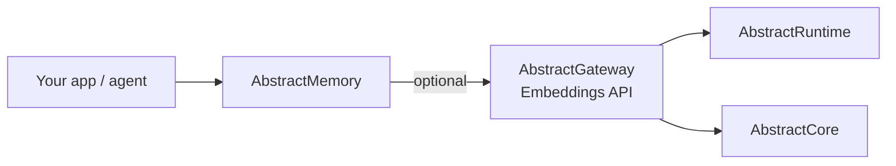
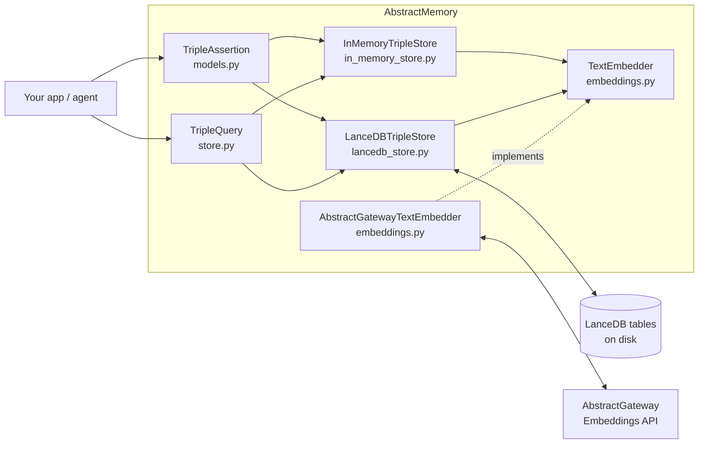

# AbstractMemory — Architecture (v0 / early)

> Updated: 2026-02-09

This document describes **what exists in this repository today** and the boundaries it enforces.

## Scope

What this package *is*:
- A small library for **append-only, temporal, provenance-aware triple assertions**.
- **Deterministic structured query semantics** over those assertions, with optional vector/semantic retrieval.

What this package is *not* (by design, not implemented here):
- A text extractor/summarizer (no AbstractCore dependency).
- A runtime provenance system (spans/artifacts live elsewhere; this package only stores pointers in `provenance`).
- A full knowledge-graph reasoner (no inference, joins, ontologies in v0).

Evidence (module map):
- Data model: [`src/abstractmemory/models.py`](../src/abstractmemory/models.py)
- Query model + protocol: [`src/abstractmemory/store.py`](../src/abstractmemory/store.py)
- Stores: [`src/abstractmemory/in_memory_store.py`](../src/abstractmemory/in_memory_store.py), [`src/abstractmemory/lancedb_store.py`](../src/abstractmemory/lancedb_store.py)
- Embeddings adapter: [`src/abstractmemory/embeddings.py`](../src/abstractmemory/embeddings.py)

## AbstractFramework boundary

AbstractMemory is one component of the **AbstractFramework** ecosystem:
- It stores/query triples and their temporal/provenance metadata.
- For semantic retrieval, it can *optionally* call an **AbstractGateway** embeddings endpoint via `AbstractGatewayTextEmbedder`.
- In a typical deployment, **AbstractRuntime** and **AbstractCore** sit behind the gateway to run models and manage provenance (this package does not depend on them directly).

Evidence:
- Gateway adapter boundary: [`src/abstractmemory/embeddings.py`](../src/abstractmemory/embeddings.py)
- No direct AbstractCore/AbstractRuntime dependency: [`pyproject.toml`](../pyproject.toml)
- Monorepo context (tests keep sibling packages import-stable): [`tests/conftest.py`](../tests/conftest.py)



Related projects:
- AbstractFramework: `https://github.com/lpalbou/AbstractFramework`
- AbstractCore: `https://github.com/lpalbou/abstractcore`
- AbstractRuntime: `https://github.com/lpalbou/abstractruntime`

## Component diagram



## Core representation

The primitive is an **append-only triple assertion**:

```
subject  --predicate-->  object
```

Represented by `abstractmemory.models.TripleAssertion` (see [`src/abstractmemory/models.py`](../src/abstractmemory/models.py)):
- Canonical fields: `subject`, `predicate`, `object` (trimmed + lowercased on creation)
- Partitioning fields: `scope` (`run|session|global`) + optional `owner_id`
- Time: `observed_at` (when recorded), optional `valid_from`/`valid_until` (when considered true)
- Provenance: `provenance` dict (e.g. `span_id`, `artifact_id`)
- Extra payload: `attributes` dict (evidence/context + retrieval metadata)

Evidence:
- Canonicalization behavior is tested in [`tests/test_term_canonicalization.py`](../tests/test_term_canonicalization.py).

## Storage backends (v0)

See also: [`docs/stores.md`](stores.md)

### In-memory (default)

`abstractmemory.in_memory_store.InMemoryTripleStore` is dependency-free and stores rows in process memory.

Key behavior:
- Optional vector indexing when constructed with an `embedder`.
- `query_text` requires an embedder; there is **no keyword fallback** (raises `ValueError`).

Evidence:
- Store implementation: [`src/abstractmemory/in_memory_store.py`](../src/abstractmemory/in_memory_store.py)
- Contract test: [`tests/test_in_memory_query_text_fallback.py`](../tests/test_in_memory_query_text_fallback.py)

### LanceDB (optional, persistent)

`abstractmemory.lancedb_store.LanceDBTripleStore` stores assertions in a local-path LanceDB table.

Key behavior:
- Creates the table on first `add(...)` (schema inferred from inserted rows).
- Stores `provenance`/`attributes` as JSON strings plus a canonical `text` column.
- Optional vector column when an `embedder` is configured.

Evidence:
- Store implementation: [`src/abstractmemory/lancedb_store.py`](../src/abstractmemory/lancedb_store.py)
- Persistence test (reopen and query): [`tests/test_lancedb_triple_store.py`](../tests/test_lancedb_triple_store.py)

## Query semantics (structured, deterministic)

See also: [`docs/api.md`](api.md)

`abstractmemory.store.TripleQuery` supports:
- Exact matching on canonicalized `subject`/`predicate`/`object`
- Partitioning via `scope` + `owner_id`
- Time filters: `since` / `until` over `observed_at` (both inclusive: `>= since`, `<= until`)
- Validity window filtering: `active_at`
  - include if `(valid_from is None or valid_from <= active_at)` and `(valid_until is None or valid_until > active_at)`
  - `valid_until` is **exclusive** (shared across both stores)
- Semantic queries:
  - `query_text` → embed then vector search (requires embedder)
  - `query_vector` → caller-supplied vector
  - `min_score` → cosine similarity threshold (implemented by both stores)

Notes on determinism:
- Structured filters and ordering by `observed_at` are deterministic (given the same stored assertions).
- Vector search behavior depends on the configured embedder + backend. For similarity-ranked results, ties are not specified.

Important implementation detail (timestamps are strings):
- Both stores compare/filter timestamps as strings.
- Use ISO-8601/RFC-3339 in UTC (e.g. `2026-01-01T00:00:00+00:00`) to keep ordering predictable.

Evidence:
- Limit semantics (`limit <= 0` means unbounded): [`tests/test_triple_store_limits.py`](../tests/test_triple_store_limits.py)

## Embeddings boundary (no AbstractCore dependency)

AbstractMemory defines a minimal `TextEmbedder` protocol and ships an HTTP adapter:
- `abstractmemory.embeddings.TextEmbedder`: interface used by stores
- `abstractmemory.embeddings.AbstractGatewayTextEmbedder`: calls an AbstractGateway embeddings endpoint

Evidence:
- Adapter implementation: [`src/abstractmemory/embeddings.py`](../src/abstractmemory/embeddings.py)

## Roadmap (non-binding)

Likely next steps (not implemented in this package as of 2026-02-09):
- More backends (e.g. SQLite reference store) while keeping the same `TripleStore` protocol
- Higher-level ingestion helpers (still likely owned by gateway/runtime, not this package)
- Schema evolution and compaction strategies for long-lived stores

Next:
- Getting started: [`docs/getting-started.md`](getting-started.md)
- API reference: [`docs/api.md`](api.md)
- FAQ: [`docs/faq.md`](faq.md)
