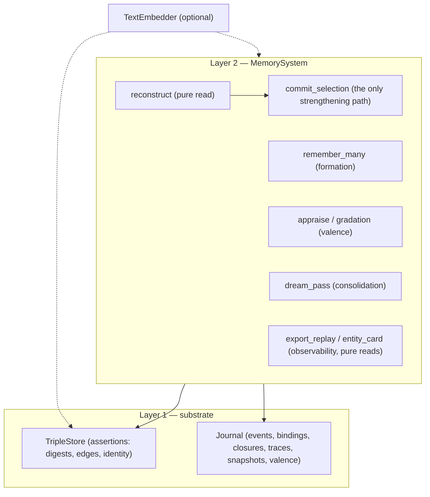

# Architecture

This document describes the package's structure and the invariants it enforces. For the cognitive model behind layer 2 (why the design looks like this), see [`memory-system.md`](memory-system.md); for call-level detail, see [`api.md`](api.md).

## The two-layer model

**Layer 1 — triple truth.** Append-only `TripleAssertion` rows with temporal and provenance metadata, deterministic structured queries (`TripleQuery`), and optional vector retrieval. Three interchangeable stores implement the `TripleStore` protocol: `InMemoryTripleStore` (volatile, vector-capable), `SQLiteTripleStore` (persistent single file, vector-capable), and `LanceDBTripleStore` (persistent, vector-capable, optional dependency). Layer 1 is independently usable: if all you need is a durable triple store with semantic search, you never have to touch layer 2.

**Layer 2 — the memory system.** `MemorySystem` composes an injected store with an injected append-only journal (`InMemoryJournal` or `SQLiteJournal`) into a usage-weighted memory graph. The store holds *what is known* (assertions: record digests, edges, identity records). The journal holds *what happened* (events, bindings, closures, traces, snapshots, valence). Neither layer imports AbstractCore or AbstractRuntime; LLM-adjacent capabilities arrive only as injected protocols (the `TextEmbedder`).

```mermaid
flowchart TB
  subgraph L2["Layer 2 — MemorySystem"]
    R["reconstruct (pure read)"] --> C["commit_selection (the only strengthening path)"]
    F["remember_many (formation)"]
    V["appraise / gradation (valence)"]
    D["dream_pass (consolidation)"]
    E["export_replay / entity_card (observability, pure reads)"]
  end
  subgraph L1["Layer 1 — substrate"]
    ST["TripleStore (assertions: digests, edges, identity)"]
    J["Journal (events, bindings, closures, traces, snapshots, valence)"]
  end
  L2 --> ST
  L2 --> J
  EMB["TextEmbedder (optional)"] -.-> L2
  EMB -.-> ST
```

For an entity home, the SQLite store and journal share one file: one file is one life.

## The journal is the time axis

Every journal record — attention event, scope binding, closure, reconstruction trace, active-memory snapshot, valence event — receives a monotonic `seq` from the journal. That single axis is the package's replay anchor:

- Every `ReconstructionResult` carries `as_of_seq`; re-running with `Stimulus(as_of=that_seq)` folds activation, trails, closures, and binding visibility to that moment and reproduces the result deterministically.
- `gradation(..., at_seq=...)`, `activation(..., at_seq=...)`, `entity_card(..., as_of=...)`, and `export_replay(since_seq=..., until_seq=...)` anchor the same way.
- Invalid anchors raise; they never silently mean "latest".

One documented limit: `as_of` anchors journal-derived signals. Triple-store truth is read current (the stores have no seq axis), so assertions added after an anchor still enter candidate gathering. Replay is exact while store contents are unchanged — the append-only common case. The entity card closes this for formed records by using each record's formation binding as its existence signal.

Write-side idempotency is uniform: a caller-supplied id (`event_id`, `binding_id`, `closure_id`, `trace_id`, `snapshot_id`, formation `idempotency_key`) makes replays journal no-ops that return the original record, so at-least-once delivery never double-writes.

## Reconstruction: the union working set

`reconstruct(stimulus, scopes=[...])` returns the union of three admission components, each labeled on its handles:

- **self** — the identity core, admitted by *binding state* (records whose folded binding is `indexed` + `active`), capped by `RecallBudget.self_fraction`. Identity is state, not usage: members are ordered by kind rank (value < purpose < trait), never by activation, and persist regardless of use.
- **stm** — short-term standing: records whose decayed activation clears `stm_floor`, capped by `stm_fraction`. This is continuity — what you were just working with.
- **stimulus** — channel retrieval for the cue: exact pattern matches, keyword scan, vector similarity, and participant co-presence, fused and ordered; spreading activation walks recorded edges and co-use trails outward from matches. A record that is both trail-hot and channel-matched is admitted once as `both`.

Two ordering guarantees: relevance admits, activation reorders (a channel-matched record can never be outranked or budget-evicted by an unmatched one, however hot); and the single best channel match is seated first against the full budget before any reservation.

## Presence is not use

Reading is never using. `reconstruct` is a pure read (with `journal=True` it appends one trace plus structurally inert audit events that never affect scores; with `journal=False` it writes nothing). `commit_selection(trace_id, used_ids)` is the **only** strengthening path: it deposits `selected` events and `co_selected` pair trails for the records that actually entered a context — and only for records admitted as `stimulus`/`both`. Records admitted as `self` or `stm` deposit nothing: rendering a memory from identity state or from the trail is presence, not use, and depositing it would make the working set self-reinforcing and un-evictable.

The same discipline extends to every derived read: inspection (`activation`, `access_counts`, `gradation`), the replay stream, the structural report, the dream pass, and the entity card all deposit nothing.

## Append-only, no deletion

There is no delete surface anywhere in the package:

- Updates are new assertions with fresh provenance.
- Belief revision is a `ClosureRecord` (`retract` or `supersede` with replacements) — the old record leaves ranked retrieval but remains in the store and in history.
- Visibility is a `ScopeBinding` fold (latest per record/scope/owner wins): `hidden` removes a record from ranked retrieval in that scope pair only; re-binding `indexed` restores it.
- Forgetting is decay of retrieval strength plus closures and silencing. Storage never decays; only the temporal-access signal does. The global access count (`selected_count`) never decays at all.

There is no compaction and no rewriting-in-place. Degradation through summarize-and-replace cannot originate in this package.

## Determinism and honesty

- Structured queries are deterministic; reconstruction is deterministic given the same journal state and anchor.
- Degraded paths carry `#FALLBACK` labels in result warnings (for example: keyword channel running as a token scan, vectorless rows skipped by the vector channel, an unreachable embedder).
- Invalid input raises actionable errors naming what was expected — unknown record ids name both id namespaces, out-of-range anchors name the journal's high-water mark.

## Module map

| Area | Modules |
|---|---|
| Layer-1 data model | `models.py` (`TripleAssertion`), `store.py` (`TripleQuery`, `TripleStore`) |
| Stores | `in_memory_store.py`, `sqlite_store.py`, `lancedb_store.py`, `vector_scoring.py` |
| Embedders | `embeddings.py`, `embeddings_openai_compat.py` |
| Journal | `journal.py` (records + protocol), `journal_memory.py`, `journal_sqlite.py` |
| Seam types | `seam.py` (`Stimulus`, `RecallBudget`, `MemoryHandle`, `ReconstructionResult`, `ActiveMemorySnapshot`, floors) |
| Reconstruction | `reconstruct.py`, `channels.py`, `spreading.py`, `shelf.py`, `self_component.py`, `folds.py` |
| Attention | `attention.py` (`AttentionConfig`, activation fold, deliberate acts) |
| Formation | `records.py` (`MemoryRecordInput`, encoding, payload tiers), `canonical_text.py` |
| Selection | `selection.py` (commit derivations) |
| Identity | `spark.py`, `engram.py`, `diary.py`, `gradation.py` |
| Facade | `system.py` (`MemorySystem`), `system_access.py`, `system_valence.py` |
| Derived reads | `consolidation.py` (sleep/dreams), `replay.py` (stream), `entity_card.py` |

## AbstractFramework boundary

In a typical deployment, AbstractRuntime orchestrates *when* memory is consulted and committed (per turn), and AbstractGateway hosts entity homes and serves the replay stream over HTTP. This package owns the mechanics — graph, journal, retrieval, folds — and stays host-agnostic: everything a host does through the facade, you can do directly against the files with only `abstractmemory` installed (see [`operator.md`](operator.md)).
