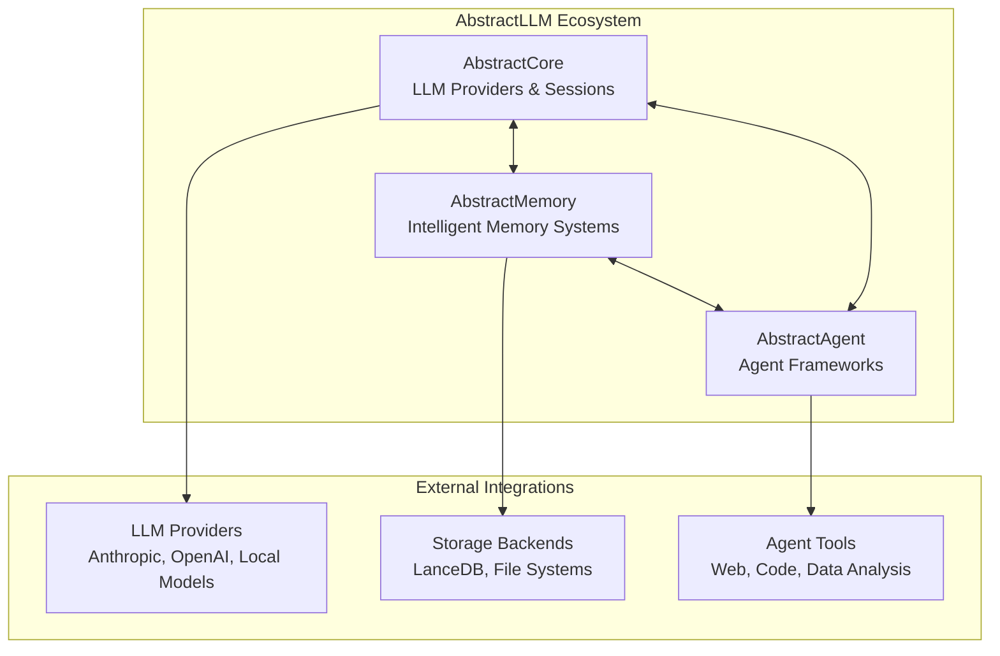

# AbstractLLM Ecosystem Integration Guide

This guide explains how AbstractMemory integrates with the broader AbstractLLM ecosystem, including AbstractCore and the future AbstractAgent package.

## 🏗️ Ecosystem Overview

AbstractMemory is part of a three-component ecosystem designed for building intelligent LLM agents:



## 🔗 Integration with AbstractCore

AbstractCore provides LLM providers and session management that work seamlessly with AbstractMemory.

### Basic Integration

```python
from abstractllm import create_llm, create_session
from abstractmemory import create_memory

# Create LLM provider
provider = create_llm("anthropic", model="claude-3-5-haiku-latest")

# Create memory for your agent
memory = create_memory("grounded", working_capacity=15, enable_kg=True)

# Create session with memory integration
session = create_session(provider=provider, memory=memory)
```

### Agent with Memory and LLM Integration

```python
class IntelligentAgent:
    def __init__(self, provider_type: str = "anthropic", model: str = "claude-3-5-haiku-latest"):
        # Initialize LLM provider
        self.provider = create_llm(provider_type, model=model)

        # Initialize sophisticated memory
        self.memory = create_memory(
            "grounded",
            working_capacity=20,
            enable_kg=True,
            semantic_threshold=3
        )

        # Set up session
        self.session = create_session(
            provider=self.provider,
            memory=self.memory,
            system_prompt=self.get_system_prompt()
        )

    def get_system_prompt(self) -> str:
        """Generate system prompt with memory context"""
        core_context = self.memory.core.get_context()
        return f"""You are an intelligent assistant with persistent memory.

{core_context}

Use your memory to provide consistent, personalized responses."""

    def chat(self, user_id: str, message: str) -> str:
        # Set user context
        self.memory.set_current_user(user_id)

        # Get memory context for this interaction
        memory_context = self.memory.get_full_context(message, user_id)

        # Generate response with memory context
        response = self.provider.generate(
            prompt=message,
            system_prompt=f"{self.get_system_prompt()}\n\nMemory Context:\n{memory_context}"
        )

        # Store interaction in memory
        self.memory.add_interaction(message, response.content)

        return response.content

# Usage
agent = IntelligentAgent()

# Multi-turn conversation with memory
response1 = agent.chat("alice", "I'm working on a Python project")
response2 = agent.chat("alice", "What libraries should I use for data analysis?")
response3 = agent.chat("alice", "Remember I mentioned Python earlier?")
# Agent remembers the Python project context
```

### Real LLM Testing Integration

AbstractMemory includes comprehensive real LLM integration tests using AbstractCore providers:

```python
# Example from tests/integration/test_real_llm_integration.py
import pytest
from abstractllm import create_llm
from abstractmemory import create_memory

@pytest.fixture
def llm_provider():
    """Create LLM provider for testing"""
    try:
        # Try Anthropic first
        return create_llm("anthropic", model="claude-3-5-haiku-latest")
    except:
        try:
            # Fallback to local models
            return create_llm("mlx", model="mlx-community/Qwen3-Coder-30B-A3B-Instruct-4bit")
        except:
            pytest.skip("No LLM provider available")

def test_memory_improves_llm_consistency(llm_provider):
    """Test that memory helps LLM maintain consistency"""
    memory = create_memory("grounded")
    memory.set_current_user("test_user")

    # Establish context
    memory.add_interaction(
        "I'm building a web app with React and Node.js",
        "Great choice! React and Node.js make a powerful full-stack combination."
    )

    # Ask related question
    context = memory.get_full_context("database recommendations")
    response = llm_provider.generate(
        prompt="What database should I use for my project?",
        system_prompt=f"Context: {context}\nProvide consistent recommendations."
    )

    # Verify LLM uses established context
    assert any(tech in response.content.lower() for tech in ["react", "node", "javascript"])
```

### Provider-Specific Optimizations

Different LLM providers may benefit from different memory configurations:

```python
class ProviderOptimizedAgent:
    def __init__(self, provider_type: str):
        self.provider_type = provider_type
        self.provider = create_llm(provider_type)

        # Optimize memory based on provider capabilities
        if provider_type == "anthropic":
            # Claude models handle longer contexts well
            self.memory = create_memory(
                "grounded",
                working_capacity=25,
                semantic_threshold=2  # Lower threshold for faster validation
            )
        elif provider_type == "openai":
            # GPT models benefit from structured context
            self.memory = create_memory(
                "grounded",
                working_capacity=15,
                semantic_threshold=3
            )
        elif provider_type in ["ollama", "mlx"]:
            # Local models may have context limitations
            self.memory = create_memory(
                "grounded",
                working_capacity=10,
                semantic_threshold=4  # Higher threshold for quality
            )

    def optimize_context_for_provider(self, context: str) -> str:
        """Optimize context format for specific provider"""
        if self.provider_type == "anthropic":
            # Claude likes structured prompts
            return f"<context>\n{context}\n</context>"
        elif self.provider_type == "openai":
            # GPT likes role-based structure
            return f"CONTEXT: {context}\n\nINSTRUCTIONS:"
        else:
            # Generic format for other providers
            return f"Context: {context}\n"
```

## 🤖 Future Integration with AbstractAgent

AbstractAgent (coming soon) will provide high-level agent frameworks that use AbstractMemory automatically.

### Planned Agent Types

```python
# Future AbstractAgent integration (planned)
from abstractagent import create_agent
from abstractmemory import create_memory

# ReAct Agent with automatic memory
react_agent = create_agent(
    "react",
    provider=create_llm("anthropic"),
    memory=create_memory("scratchpad"),  # Automatically optimized
    tools=["web_search", "calculator", "code_executor"]
)

# Autonomous Assistant with sophisticated memory
assistant = create_agent(
    "autonomous",
    provider=create_llm("anthropic"),
    memory=create_memory("grounded", enable_kg=True),  # Full capabilities
    capabilities=["learning", "multi_user", "persistence"]
)

# Customer Service Agent with domain memory
service_agent = create_agent(
    "customer_service",
    provider=create_llm("openai"),
    memory=create_memory("grounded", semantic_threshold=2),
    knowledge_base="company_kb",
    escalation_rules="support_rules"
)
```

### Agent Framework Integration Patterns

```python
class BaseAgentFramework:
    """Base class for agent frameworks using AbstractMemory"""

    def __init__(self, agent_type: str, provider, memory_config: dict = None):
        self.agent_type = agent_type
        self.provider = provider

        # Auto-select memory type based on agent
        self.memory = self.create_optimal_memory(agent_type, memory_config or {})

        # Set up monitoring and optimization
        self.performance_monitor = MemoryPerformanceMonitor()

    def create_optimal_memory(self, agent_type: str, config: dict):
        """Create optimal memory configuration for agent type"""
        if agent_type in ["react", "task", "tool"]:
            return create_memory("scratchpad", **config)
        elif agent_type in ["chatbot", "faq", "simple"]:
            return create_memory("buffer", **config)
        elif agent_type in ["autonomous", "assistant", "learning"]:
            return create_memory("grounded", **config)
        else:
            # Default to grounded for unknown types
            return create_memory("grounded", **config)

    def execute_with_memory(self, task: str, user_id: str = None) -> str:
        """Execute task with automatic memory management"""
        if user_id and hasattr(self.memory, 'set_current_user'):
            self.memory.set_current_user(user_id)

        # Get memory context
        context = self.get_memory_context(task)

        # Execute with provider
        with self.performance_monitor.measure_operation("execute", self.agent_type):
            response = self.provider.generate(
                prompt=task,
                system_prompt=context
            )

        # Store in memory
        if hasattr(self.memory, 'add_interaction'):
            self.memory.add_interaction(task, response.content)
        elif hasattr(self.memory, 'add_thought'):
            self.memory.add_thought(f"Task: {task}")
            self.memory.add_observation(f"Result: {response.content}")

        return response.content

    def get_memory_context(self, task: str) -> str:
        """Get appropriate memory context for task"""
        if hasattr(self.memory, 'get_full_context'):
            return self.memory.get_full_context(task)
        elif hasattr(self.memory, 'get_context'):
            return self.memory.get_context()
        else:
            return ""
```

## 🔧 Configuration Management

### Environment-Based Configuration

```python
import os
from typing import Dict, Any

class MemoryConfigManager:
    """Manage memory configurations across environments"""

    def __init__(self):
        self.configs = {
            "development": {
                "working_capacity": 5,
                "semantic_threshold": 2,
                "enable_kg": False,
                "core_update_threshold": 3
            },
            "testing": {
                "working_capacity": 3,
                "semantic_threshold": 1,
                "enable_kg": True,
                "core_update_threshold": 2
            },
            "production": {
                "working_capacity": 20,
                "semantic_threshold": 3,
                "enable_kg": True,
                "core_update_threshold": 5
            },
            "high_volume": {
                "working_capacity": 50,
                "semantic_threshold": 5,
                "enable_kg": True,
                "core_update_threshold": 10
            }
        }

    def get_config(self, environment: str = None) -> Dict[str, Any]:
        """Get configuration for environment"""
        env = environment or os.getenv("ABSTRACTMEMORY_ENV", "development")
        return self.configs.get(env, self.configs["development"])

    def create_memory_for_env(self, memory_type: str = "grounded", environment: str = None):
        """Create memory instance optimized for environment"""
        config = self.get_config(environment)
        return create_memory(memory_type, **config)

# Usage
config_manager = MemoryConfigManager()

# Development memory
dev_memory = config_manager.create_memory_for_env("grounded", "development")

# Production memory
prod_memory = config_manager.create_memory_for_env("grounded", "production")
```

### Configuration Validation

```python
from dataclasses import dataclass
from typing import Optional

@dataclass
class MemoryConfig:
    """Validated memory configuration"""
    working_capacity: int = 10
    semantic_threshold: int = 3
    enable_kg: bool = True
    core_update_threshold: int = 5
    max_total_items: int = 10000
    cleanup_interval: int = 3600  # seconds

    def __post_init__(self):
        """Validate configuration values"""
        if self.working_capacity < 1:
            raise ValueError("working_capacity must be >= 1")
        if self.semantic_threshold < 1:
            raise ValueError("semantic_threshold must be >= 1")
        if self.core_update_threshold < 1:
            raise ValueError("core_update_threshold must be >= 1")
        if self.max_total_items < 100:
            raise ValueError("max_total_items must be >= 100")

def create_validated_memory(memory_type: str, config: MemoryConfig):
    """Create memory with validated configuration"""
    return create_memory(
        memory_type,
        working_capacity=config.working_capacity,
        semantic_threshold=config.semantic_threshold,
        enable_kg=config.enable_kg,
        core_update_threshold=config.core_update_threshold
    )

# Usage
config = MemoryConfig(
    working_capacity=15,
    semantic_threshold=2,
    enable_kg=True
)

memory = create_validated_memory("grounded", config)
```

## 📊 Monitoring and Analytics Integration

### Memory Performance Dashboard

```python
class MemoryAnalyticsDashboard:
    """Analytics dashboard for memory performance"""

    def __init__(self, memory_instances: Dict[str, Any]):
        self.memories = memory_instances
        self.metrics = defaultdict(list)

    def collect_metrics(self):
        """Collect metrics from all memory instances"""
        for name, memory in self.memories.items():
            if hasattr(memory, 'get_statistics'):
                stats = memory.get_statistics()
                self.metrics[name].append({
                    "timestamp": datetime.now(),
                    "memory_usage": stats.get("memory_usage", 0),
                    "item_count": stats.get("item_count", 0),
                    "query_performance": stats.get("avg_query_time", 0),
                    "consolidation_rate": stats.get("consolidation_rate", 0)
                })

    def generate_report(self) -> Dict[str, Any]:
        """Generate analytics report"""
        report = {}
        for name, metrics in self.metrics.items():
            if metrics:
                latest = metrics[-1]
                report[name] = {
                    "current_items": latest["item_count"],
                    "memory_usage_mb": latest["memory_usage"] / 1024 / 1024,
                    "avg_query_time_ms": latest["query_performance"] * 1000,
                    "health_status": self.assess_health(metrics)
                }
        return report

    def assess_health(self, metrics: list) -> str:
        """Assess memory health based on metrics"""
        if not metrics:
            return "unknown"

        latest = metrics[-1]
        if latest["memory_usage"] > 500 * 1024 * 1024:  # 500MB
            return "warning"
        if latest["query_performance"] > 0.5:  # 500ms
            return "slow"
        return "healthy"

# Usage
dashboard = MemoryAnalyticsDashboard({
    "agent_1": create_memory("grounded"),
    "agent_2": create_memory("scratchpad"),
    "agent_3": create_memory("buffer")
})

# Collect metrics periodically
dashboard.collect_metrics()
report = dashboard.generate_report()
```

## 🧪 Testing Integration Patterns

### Integration Test Framework

```python
import pytest
from abstractllm import create_llm
from abstractmemory import create_memory

class IntegrationTestFramework:
    """Framework for testing AbstractLLM ecosystem integration"""

    @pytest.fixture
    def llm_provider(self):
        """Provide LLM for testing"""
        providers = ["anthropic", "openai", "mlx", "ollama"]
        for provider_type in providers:
            try:
                return create_llm(provider_type)
            except:
                continue
        pytest.skip("No LLM provider available")

    @pytest.fixture
    def memory_types(self):
        """Provide different memory types for testing"""
        return {
            "scratchpad": create_memory("scratchpad"),
            "buffer": create_memory("buffer"),
            "grounded": create_memory("grounded")
        }

    def test_memory_llm_integration(self, llm_provider, memory_types):
        """Test memory and LLM working together"""
        for memory_type, memory in memory_types.items():
            # Add some context to memory
            if hasattr(memory, 'add_interaction'):
                memory.add_interaction("Test input", "Test response")
            elif hasattr(memory, 'add_thought'):
                memory.add_thought("Test thought")

            # Get context and generate response
            context = memory.get_context() if hasattr(memory, 'get_context') else ""
            response = llm_provider.generate(
                prompt="Respond using the context provided",
                system_prompt=f"Context: {context}"
            )

            assert response.content
            assert len(response.content) > 0

    def test_multi_turn_conversation(self, llm_provider):
        """Test multi-turn conversation with memory"""
        memory = create_memory("grounded")
        memory.set_current_user("test_user")

        conversations = [
            ("What's 2+2?", "4"),
            ("What about 3+3?", "6"),
            ("Remember the first calculation?", "2+2")
        ]

        for question, expected_content in conversations:
            context = memory.get_full_context(question)
            response = llm_provider.generate(
                prompt=question,
                system_prompt=f"Previous context: {context}"
            )

            # Store interaction
            memory.add_interaction(question, response.content)

            # For the last question, verify memory usage
            if "Remember" in question:
                assert any(exp in response.content for exp in ["2+2", "4", "first"])

# Usage
framework = IntegrationTestFramework()
# Run tests with: pytest test_integration.py -v
```

### Performance Benchmarking

```python
import time
import statistics
from typing import List, Dict

class PerformanceBenchmark:
    """Benchmark AbstractMemory integration performance"""

    def __init__(self):
        self.results = defaultdict(list)

    def benchmark_memory_operations(self, memory, operations: int = 1000):
        """Benchmark basic memory operations"""
        # Benchmark add operations
        start_time = time.time()
        for i in range(operations):
            if hasattr(memory, 'add_interaction'):
                memory.add_interaction(f"Input {i}", f"Response {i}")
            elif hasattr(memory, 'add_thought'):
                memory.add_thought(f"Thought {i}")

        add_time = time.time() - start_time
        self.results[f"{type(memory).__name__}_add"].append(add_time)

        # Benchmark retrieve operations
        start_time = time.time()
        for i in range(min(operations, 100)):  # Fewer retrieval tests
            if hasattr(memory, 'get_full_context'):
                memory.get_full_context(f"query {i}")
            elif hasattr(memory, 'get_context'):
                memory.get_context()

        retrieve_time = time.time() - start_time
        self.results[f"{type(memory).__name__}_retrieve"].append(retrieve_time)

    def benchmark_integration(self, llm_provider, memory, interactions: int = 100):
        """Benchmark full LLM + Memory integration"""
        start_time = time.time()

        for i in range(interactions):
            # Get context
            context = ""
            if hasattr(memory, 'get_full_context'):
                context = memory.get_full_context(f"query {i}")
            elif hasattr(memory, 'get_context'):
                context = memory.get_context()

            # Generate response
            response = llm_provider.generate(
                prompt=f"Query {i}",
                system_prompt=f"Context: {context}"
            )

            # Store interaction
            if hasattr(memory, 'add_interaction'):
                memory.add_interaction(f"Query {i}", response.content)

        total_time = time.time() - start_time
        self.results[f"integration_{type(memory).__name__}"].append(total_time)

    def generate_performance_report(self) -> Dict[str, Dict[str, float]]:
        """Generate performance report"""
        report = {}
        for operation, times in self.results.items():
            report[operation] = {
                "mean": statistics.mean(times),
                "median": statistics.median(times),
                "min": min(times),
                "max": max(times),
                "std_dev": statistics.stdev(times) if len(times) > 1 else 0
            }
        return report

# Usage
benchmark = PerformanceBenchmark()

# Test different memory types
for memory_type in ["scratchpad", "buffer", "grounded"]:
    memory = create_memory(memory_type)
    benchmark.benchmark_memory_operations(memory, 1000)

# Test integration
provider = create_llm("anthropic")
grounded_memory = create_memory("grounded")
benchmark.benchmark_integration(provider, grounded_memory, 50)

# Get report
report = benchmark.generate_performance_report()
```

## 🚀 Production Deployment Patterns

### Scalable Memory Architecture

```python
class ScalableMemoryManager:
    """Manage memory across multiple agent instances"""

    def __init__(self, config: dict):
        self.config = config
        self.memory_pool = {}
        self.load_balancer = LoadBalancer()

    def get_memory_for_user(self, user_id: str, agent_type: str):
        """Get or create memory instance for user"""
        memory_key = f"{agent_type}_{user_id}"

        if memory_key not in self.memory_pool:
            # Create new memory instance
            memory_config = self.config.get(agent_type, {})
            memory = create_memory("grounded", **memory_config)
            memory.set_current_user(user_id)

            # Add to pool
            self.memory_pool[memory_key] = {
                "memory": memory,
                "last_accessed": datetime.now(),
                "access_count": 0
            }

        # Update access statistics
        self.memory_pool[memory_key]["last_accessed"] = datetime.now()
        self.memory_pool[memory_key]["access_count"] += 1

        return self.memory_pool[memory_key]["memory"]

    def cleanup_unused_memories(self, max_idle_hours: int = 24):
        """Clean up unused memory instances"""
        cutoff_time = datetime.now() - timedelta(hours=max_idle_hours)
        to_remove = []

        for key, data in self.memory_pool.items():
            if data["last_accessed"] < cutoff_time:
                # Backup before removal
                self.backup_memory(key, data["memory"])
                to_remove.append(key)

        for key in to_remove:
            del self.memory_pool[key]

    def backup_memory(self, key: str, memory):
        """Backup memory state before cleanup"""
        # Implementation depends on storage backend
        pass

# Usage in production
manager = ScalableMemoryManager({
    "customer_service": {"working_capacity": 15, "semantic_threshold": 2},
    "personal_assistant": {"working_capacity": 25, "semantic_threshold": 3}
})

# Get memory for specific user and agent type
memory = manager.get_memory_for_user("user_123", "customer_service")
```

This integration guide provides a comprehensive overview of how AbstractMemory fits into the broader AbstractLLM ecosystem, with practical examples for current AbstractCore integration and future AbstractAgent compatibility.