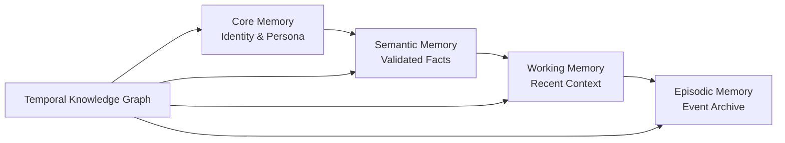

# Memory Types Guide

This guide provides detailed information about each memory type in AbstractMemory, their use cases, internal structure, and practical examples.

## 🧠 Memory Type Selection

AbstractMemory uses a **two-tier strategy** to match memory complexity with agent purpose:

```python
from abstractmemory import create_memory

# Tier 1: Simple Memory
scratchpad = create_memory("scratchpad")  # For ReAct agents
buffer = create_memory("buffer")          # For chatbots

# Tier 2: Complex Memory
grounded = create_memory("grounded")      # For autonomous agents
```

## 📋 Tier 1: Simple Memory Types

### ScratchpadMemory

**Purpose**: ReAct agents with thought-action-observation cycles

**When to Use:**
- Task-specific agents (code generation, web search, calculations)
- Agents that follow structured reasoning patterns
- Short-lived interactions with bounded context

**Internal Structure:**
```python
class ScratchpadMemory:
    def __init__(self, max_entries: int = 50):
        self.thoughts: List[str] = []
        self.actions: List[Dict] = []
        self.observations: List[str] = []
        self.entries: deque = deque(maxlen=max_entries)  # Bounded capacity
```

**Key Features:**
- **Bounded capacity**: Automatically removes oldest entries when full
- **Structured reasoning**: Separate thought, action, observation tracking
- **Fast operations**: < 1ms for typical operations
- **Context formatting**: LLM-ready output format

**Example Usage:**
```python
from abstractmemory import create_memory

# Create ReAct agent memory
scratchpad = create_memory("scratchpad", max_entries=100)

# ReAct reasoning cycle
scratchpad.add_thought("User wants to calculate the area of a circle with radius 5")
scratchpad.add_action("calculate", {"formula": "π * r²", "radius": 5})
scratchpad.add_observation("Calculated area: 78.54 square units")
scratchpad.add_thought("Should provide explanation with the result")

# Get formatted context for LLM
context = scratchpad.get_context()
print(context)
# Output:
# Thought: User wants to calculate the area of a circle with radius 5
# Action: calculate {"formula": "π * r²", "radius": 5}
# Observation: Calculated area: 78.54 square units
# Thought: Should provide explanation with the result
```

**Memory Bounds:**
- Default capacity: 50 entries
- Configurable up to 200 entries
- Automatic overflow handling with FIFO removal

### BufferMemory

**Purpose**: Simple conversation history for chatbots

**When to Use:**
- Basic chatbots with conversation continuity
- FAQ systems with context awareness
- Customer service bots with recent history

**Internal Structure:**
```python
class BufferMemory:
    def __init__(self, max_messages: int = 100):
        self.messages: deque = deque(maxlen=max_messages)
```

**Key Features:**
- **Message pairs**: User-assistant conversation tracking
- **Automatic pruning**: Oldest messages removed when capacity reached
- **Multiple formats**: LLM-ready and human-readable outputs
- **Timestamps**: Automatic message timestamping

**Example Usage:**
```python
from abstractmemory import create_memory

# Create chatbot memory
buffer = create_memory("buffer", max_messages=50)

# Add conversation messages
buffer.add_message("user", "Hello! How can I get started with Python?")
buffer.add_message("assistant", "Great question! I'd recommend starting with the official Python tutorial...")
buffer.add_message("user", "What about data science libraries?")
buffer.add_message("assistant", "For data science, you'll want to learn pandas, numpy, and matplotlib...")

# Get conversation context
context = buffer.get_context()
print(context)
# Output:
# User: Hello! How can I get started with Python?
# Assistant: Great question! I'd recommend starting with the official Python tutorial...
# User: What about data science libraries?
# Assistant: For data science, you'll want to learn pandas, numpy, and matplotlib...

# Get LLM-formatted messages
llm_messages = buffer.get_messages_for_llm()
# Returns: [{"role": "user", "content": "..."}, {"role": "assistant", "content": "..."}, ...]
```

**Memory Bounds:**
- Default capacity: 100 messages (50 pairs)
- Configurable up to 500 messages
- Memory usage: ~50KB for typical capacity

## 🏛️ Tier 2: Complex Memory (GroundedMemory)

### GroundedMemory Overview

**Purpose**: Sophisticated autonomous agents with persistent, grounded memory

**When to Use:**
- Personal assistants with user learning
- Multi-session conversational agents
- Agents requiring fact validation and temporal reasoning
- Systems with multi-user context separation

**Four-Tier Architecture:**


**Example Creation:**
```python
from abstractmemory import create_memory

# Create autonomous agent memory
memory = create_memory(
    "grounded",
    working_capacity=15,           # Working memory size
    enable_kg=True,               # Enable knowledge graph
    semantic_threshold=3,         # Fact validation threshold
    core_update_threshold=5       # Core memory update threshold
)

# Set current user context
memory.set_current_user("alice", relationship="owner")
```

### Core Memory Component

**Purpose**: Agent identity and current user context (MemGPT/Letta pattern)

**Characteristics:**
- **Always active**: Included in every LLM call
- **Self-editing**: Agent can update its own identity
- **Bounded size**: ~200 tokens per block, max 10 blocks
- **High persistence**: Core facts never expire

**Internal Structure:**
```python
class CoreMemory:
    def __init__(self):
        self.blocks = {
            "persona": Block("I am an AI assistant"),
            "user_info": Block("Current user: Unknown"),
            # ... additional custom blocks
        }
```

**Example Usage:**
```python
# Update agent persona (self-editing)
memory.update_core_memory("persona",
    "I am a Python expert assistant specialized in data science and web development")

# Add user-specific information
memory.set_current_user("alice", relationship="owner")
memory.learn_about_user("Prefers detailed explanations")
memory.learn_about_user("Works in data science")

# Core memory automatically updates after threshold reached
context = memory.core.get_context()
print(context)
# Output:
# === Core Memory ===
# Persona: I am a Python expert assistant specialized in data science and web development
# User Info: Current user: alice (owner)
# - Prefers detailed explanations
# - Works in data science
```

### Semantic Memory Component

**Purpose**: Validated facts and knowledge learned over time

**Validation Process:**
1. **Occurrence counting**: Facts must appear 3+ times (configurable)
2. **Confidence scoring**: Grows with repetition (0.3 + count * 0.1)
3. **Concept linking**: Related facts connected together
4. **Query ranking**: Results ranked by confidence

**Example Usage:**
```python
# Learning process (automatic through interactions)
memory.add_interaction("Python is great for data science", "Absolutely! Python has excellent libraries...")
memory.add_interaction("I love Python's data science tools", "Yes, pandas and numpy are fantastic...")
memory.add_interaction("Python data science is powerful", "The ecosystem is very mature...")

# After 3+ mentions, fact gets validated
validated_facts = memory.semantic.retrieve("Python data science")
for fact in validated_facts:
    print(f"Fact: {fact.content} (confidence: {fact.confidence})")
# Output:
# Fact: Python is excellent for data science (confidence: 0.6)
```

### Working Memory Component

**Purpose**: Recent context with sliding window management

**Characteristics:**
- **Sliding window**: Most recent N items (default: 10)
- **Auto-consolidation**: Important items promoted to long-term memory
- **Fast access**: Always available for context generation
- **Temporary storage**: Items eventually moved to episodic/semantic

**Example Usage:**
```python
# Recent interactions automatically tracked
memory.add_interaction("How do I install pandas?", "You can install pandas using: pip install pandas")
memory.add_interaction("What about matplotlib?", "Similarly: pip install matplotlib")

# Working memory maintains recent context
working_context = memory.working.get_context()
print(working_context)
# Shows last 10 interactions in chronological order
```

### Episodic Memory Component

**Purpose**: Long-term event archive with temporal organization

**Characteristics:**
- **Temporal anchoring**: Every episode has precise timestamps
- **Unlimited capacity**: Long-term storage for all experiences
- **Time-based queries**: "What happened last week?"
- **Content retrieval**: "Tell me about our Python discussions"

**Example Usage:**
```python
# Episodes automatically created from interactions
memory.add_interaction("I'm building a machine learning model",
                      "Great! What type of ML problem are you working on?")

# Query episodes by time
last_week = datetime.now() - timedelta(days=7)
recent_episodes = memory.episodic.retrieve_by_timeframe(last_week, datetime.now())

# Query episodes by content
ml_episodes = memory.episodic.retrieve("machine learning")
for episode in ml_episodes:
    print(f"{episode.event_time}: {episode.content}")
```

### Temporal Knowledge Graph Component

**Purpose**: Bi-temporal fact relationships with contradiction handling

**Key Concepts:**
- **Event time**: When something actually happened
- **Ingestion time**: When we learned about it
- **Validity spans**: When facts were considered true
- **Contradiction resolution**: Newer facts invalidate older ones

**Example Usage:**
```python
# Facts automatically extracted and stored
memory.add_interaction("I work at TechCorp", "That's interesting! What do you do there?")
# Later...
memory.add_interaction("I started working at DataCorp", "Congratulations on the new job!")

# Query knowledge at specific time
now = datetime.now()
last_month = now - timedelta(days=30)

# What we knew last month vs now
old_facts = memory.kg.query_at_time("works_at", last_month)  # TechCorp
current_facts = memory.kg.query_at_time("works_at", now)     # DataCorp

# Track entity evolution
alice_evolution = memory.kg.get_entity_evolution("alice", last_month, now)
# Shows: alice works_at TechCorp (old), alice works_at DataCorp (new)
```

## 🔧 Configuration Guide

### Simple Memory Configuration

```python
# ScratchpadMemory options
scratchpad = create_memory("scratchpad",
    max_entries=50,        # Capacity limit (default: 50)
)

# BufferMemory options
buffer = create_memory("buffer",
    max_messages=100,      # Message history limit (default: 100)
)
```

### Complex Memory Configuration

```python
# GroundedMemory comprehensive configuration
grounded = create_memory("grounded",
    # Working memory settings
    working_capacity=10,              # Working memory size (default: 10)

    # Semantic memory settings
    semantic_threshold=3,             # Fact validation threshold (default: 3)

    # Core memory settings
    core_update_threshold=5,          # Core promotion threshold (default: 5)

    # Knowledge graph settings
    enable_kg=True,                   # Enable knowledge graph (default: True)

    # Multi-user settings
    default_user_id="default",        # Default user context

    # Future: Storage backend
    # storage_backend="lancedb",      # Persistence backend
)
```

## 📊 Performance Characteristics

### Simple Memory Performance
```
Operation          | ScratchpadMemory | BufferMemory
-------------------|------------------|-------------
Add Entry          | < 1ms           | < 1ms
Get Context        | < 5ms           | < 3ms
Memory Usage       | ~100KB          | ~50KB
Capacity           | 50-100 entries  | 50-200 messages
```

### Complex Memory Performance
```
Operation                    | GroundedMemory   | Notes
----------------------------|------------------|------------------------
Add Interaction             | < 10ms          | Includes KG extraction
Get Full Context            | < 100ms         | All tiers + user profile
Semantic Validation         | < 5ms           | Per fact validation
Memory Consolidation        | < 200ms         | Working → Long-term
Knowledge Graph Query       | < 50ms          | Temporal fact retrieval
Multi-user Context Switch   | < 20ms          | User profile loading
```

## 🔍 Choosing the Right Memory Type

### Decision Matrix

| Agent Type | Memory Type | Reasoning |
|------------|-------------|-----------|
| ReAct Agent | `scratchpad` | Structured reasoning, bounded context |
| Simple Chatbot | `buffer` | Conversation history, no learning |
| FAQ Bot | `buffer` | Recent context sufficient |
| Code Assistant | `scratchpad` | Task-focused, step-by-step reasoning |
| Personal Assistant | `grounded` | User learning, multi-session memory |
| Customer Service | `grounded` | User profiles, fact validation |
| Research Assistant | `grounded` | Knowledge accumulation, temporal reasoning |

### Migration Path

You can easily upgrade memory types as agent sophistication grows:

```python
# Start simple
memory = create_memory("buffer", max_messages=50)

# Later upgrade to grounded for learning capabilities
memory = create_memory("grounded", working_capacity=10)
memory.import_conversation_history(old_buffer_messages)
```

## 🧪 Testing Your Memory Implementation

### Simple Memory Testing
```python
def test_my_agent():
    memory = create_memory("scratchpad")

    # Test reasoning cycle
    memory.add_thought("Planning task...")
    memory.add_action("execute", {"cmd": "test"})
    memory.add_observation("Task completed")

    context = memory.get_context()
    assert "Planning task" in context
    assert "execute" in context
    assert "Task completed" in context
```

### Complex Memory Testing
```python
def test_learning_agent():
    memory = create_memory("grounded")
    memory.set_current_user("testuser")

    # Test learning progression
    for i in range(4):  # Above semantic threshold
        memory.learn_about_user("likes Python")

    # Verify learning
    user_facts = memory.semantic.retrieve("Python")
    assert len(user_facts) > 0
    assert any("likes Python" in fact.content for fact in user_facts)
```

This guide provides the foundation for understanding and implementing AbstractMemory's memory types effectively. Choose the right memory type for your agent's complexity and watch your AI systems become more consistent, personalized, and intelligent over time.