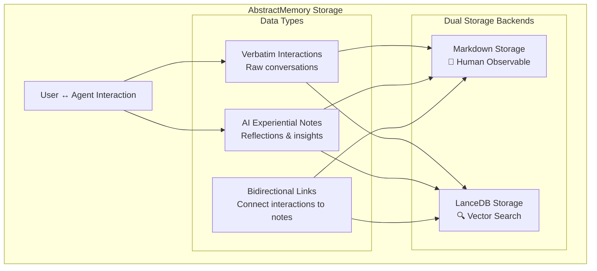

# Storage Systems Guide

AbstractMemory provides sophisticated storage capabilities for persistent, observable AI memory. This guide covers the dual storage architecture that saves both verbatim interactions and AI experiential notes.

## 🏗️ Storage Architecture Overview

AbstractMemory implements a **dual storage strategy** that maintains both raw interaction data and AI reflections:



## 📁 Storage Modes

### None (Default)
No persistence - zero overhead for applications that don't need storage.

```python
memory = create_memory("grounded")  # No storage parameters
```

### Markdown Storage
Human-readable, version-controllable, completely observable AI memory.

```python
memory = create_memory(
    "grounded",
    storage_backend="markdown",
    storage_path="./memory"
)
```

**Benefits:**
- 📄 **Complete observability** - See exactly what AI remembers
- 🔍 **Git-friendly** - Version control AI memory evolution
- 🧑‍💻 **Human readable** - Markdown format for easy inspection
- 🗂️ **Organized structure** - Time-based hierarchical organization

### LanceDB Storage
High-performance vector search with SQL capabilities via AbstractCore embeddings.

```python
from abstractllm import create_llm

provider = create_llm("openai", embedding_model="text-embedding-3-small")

memory = create_memory(
    "grounded",
    storage_backend="lancedb",
    storage_uri="./memory.db",
    embedding_provider=provider
)
```

**Benefits:**
- ⚡ **Vector search** - Semantic similarity via embeddings
- 🗃️ **SQL queries** - Complex temporal and relational filtering
- 📈 **Scalable** - Handles large datasets efficiently
- 🔗 **Embedding integration** - Uses AbstractCore for embeddings

### Dual Storage
Best of both worlds - complete observability with powerful search.

```python
memory = create_memory(
    "grounded",
    storage_backend="dual",
    storage_path="./memory",
    storage_uri="./memory.db",
    embedding_provider=provider
)
```

**Benefits:**
- 📄 **Observable** - Markdown files for transparency
- 🔍 **Searchable** - Vector search via LanceDB
- 🔄 **Synchronized** - Both backends always in sync
- 🎯 **Optimal** - Read from LanceDB, inspect via markdown

## 🗂️ Markdown Storage Structure

The markdown storage creates a time-organized, user-separated structure:

```
memory/
├── verbatim/                         # Raw interactions as they happened
│   └── {user}/
│       └── {yyyy}/{mm}/{dd}/
│           └── {HH}-{MM}-{SS}_{topic}_{interaction_id}.md
│
├── experiential/                     # AI's experiential notes & reflections
│   └── {yyyy}/{mm}/{dd}/
│       └── {HH}-{MM}-{SS}_{reflection_type}_{note_id}.md
│
├── links/                            # Bidirectional links
│   └── {yyyy}/{mm}/{dd}/
│       └── {interaction_id}_to_{note_id}.json
│
├── core/                             # Memory component snapshots
│   ├── core_2025-09-24.json
│   ├── semantic_2025-09-24.json
│   └── working_2025-09-24.json
│
└── index.json                        # Master index with metadata
```

### Verbatim Interaction Format

```markdown
# Interaction: python_programming

**ID**: `int_abc123`
**Date**: 2025-09-24T10:30:45
**User**: alice
**Topic**: python_programming

## Metadata

- **relationship**: owner
- **session_id**: sess_xyz789
- **confidence**: 0.9

## User Input

I'm learning Python and need help with list comprehensions.

## Agent Response

List comprehensions are a powerful Python feature! Here's how they work:

```python
# Basic syntax: [expression for item in iterable]
numbers = [1, 2, 3, 4, 5]
squares = [x**2 for x in numbers]
print(squares)  # [1, 4, 9, 16, 25]
```

## Links

- [AI Reflection note_def456](../../experiential/2025/09/24/10-31-02_learning_reflection_note_def456.md)

---
*Generated by AbstractMemory - 2025-09-24T10:30:45*
```

### AI Experiential Note Format

```markdown
# AI Learning_Reflection: note_def456

**Note ID**: `note_def456`
**Date**: 2025-09-24T10:31:02
**Type**: learning_reflection
**Triggered by**: [Interaction int_abc123](../../verbatim/alice/2025/09/24/10-30-45_python_programming_int_abc123.md)

## Context

- **user_id**: alice
- **trigger**: user_learning
- **confidence_change**: +0.1

## Reflection

🧠 **User Learning Detected**: Alice is actively learning Python concepts

The user expressed interest in list comprehensions, indicating they're moving beyond basic Python syntax into more advanced features. This suggests:

1. **Skill Level**: Intermediate beginner - knows basics, ready for advanced concepts
2. **Learning Style**: Prefers practical examples with code
3. **Topic Interest**: Data manipulation and Pythonic code patterns

## Memory Impact

- **Working Memory**: Added interaction to recent context
- **Episodic Memory**: Stored as complete learning episode
- **Semantic Memory**: Validated user preference for "code examples"
- **Knowledge Graph**: Updated Alice → learns → Python relationship

## Future Considerations

👋 Continue building user profile • 📚 User in learning mode - provide educational content • 🔍 Monitor for advanced Python topics

---
*AI experiential note generated by AbstractMemory - 2025-09-24T10:31:02*
```

### Bidirectional Link Format

```json
{
  "interaction_id": "int_abc123",
  "note_id": "note_def456",
  "created": "2025-09-24T10:31:02",
  "type": "bidirectional"
}
```

## 🧠 AI Reflection System

AbstractMemory automatically generates experiential notes based on intelligent triggers:

### Trigger Types

1. **User Learning Detection**
   ```
   Triggers: "I am", "I prefer", "I like", "I usually", "my"
   Note Type: user_profile_update
   ```

2. **Pattern Recognition**
   ```
   Triggers: "failed", "worked", "usually", "always", "never"
   Note Type: pattern_learning
   ```

3. **Topic Shifts**
   ```
   Triggers: "by the way", "switching topics", "moving on"
   Note Type: topic_transition
   ```

4. **Confidence Changes**
   ```
   Triggers: High certainty/uncertainty language
   Note Type: confidence_assessment
   ```

5. **Periodic Consolidation**
   ```
   Triggers: Every 10th interaction
   Note Type: periodic_reflection
   ```

### Reflection Content Structure

Each experiential note contains:

- **Interaction Analysis** - What patterns were detected
- **Key Observations** - Specific insights about the interaction
- **Memory Impact** - How different memory tiers were affected
- **Future Considerations** - Guidance for subsequent interactions

## 🔍 Search Capabilities

### Markdown Storage Search

Text-based search using filesystem patterns and content matching:

```python
# Search by content
results = memory.search_stored_interactions("python programming")

# Search by user
alice_results = memory.search_stored_interactions("python", user_id="alice")

# Search by time range
from datetime import datetime, timedelta
recent = memory.search_stored_interactions(
    "learning",
    start_date=datetime.now() - timedelta(days=7),
    end_date=datetime.now()
)
```

### LanceDB Storage Search

Advanced search combining SQL filters and vector similarity:

```python
# Vector similarity search (requires AbstractCore embeddings)
similar_results = memory.search_stored_interactions("machine learning algorithms")

# Combined SQL + vector search
filtered_results = memory.search_stored_interactions(
    "programming",
    user_id="alice",
    start_date=datetime.now() - timedelta(days=30)
)
```

## ⚙️ Configuration Guide

### Basic Configuration

```python
from abstractmemory import create_memory

# No storage (default)
memory = create_memory("grounded")

# Markdown only
memory = create_memory(
    "grounded",
    storage_backend="markdown",
    storage_path="./ai_memory"
)

# LanceDB only (requires AbstractCore with embeddings)
from abstractllm import create_llm
provider = create_llm("openai", embedding_model="text-embedding-3-small")

memory = create_memory(
    "grounded",
    storage_backend="lancedb",
    storage_uri="./memory.db",
    embedding_provider=provider
)

# Dual storage
memory = create_memory(
    "grounded",
    storage_backend="dual",
    storage_path="./ai_memory",
    storage_uri="./memory.db",
    embedding_provider=provider
)
```

### Advanced Configuration

```python
# Production configuration
memory = create_memory(
    "grounded",
    storage_backend="dual",
    storage_path="/var/ai/memory",
    storage_uri="/var/ai/memory.db",
    embedding_provider=provider,
    working_capacity=20,          # Larger working memory
    semantic_threshold=3,         # Standard validation
    core_update_threshold=5       # Conservative core updates
)

# Development configuration
memory = create_memory(
    "grounded",
    storage_backend="markdown",
    storage_path="./dev_memory",
    working_capacity=5,           # Smaller for testing
    semantic_threshold=2,         # Faster validation
    core_update_threshold=3       # Quicker core updates
)
```

## 📊 Monitoring and Statistics

### Storage Statistics

```python
stats = memory.get_storage_stats()
print(f"Storage mode: {stats['mode']}")
print(f"Total interactions: {stats['markdown_stats']['total_interactions']}")
print(f"AI reflections: {stats['markdown_stats']['total_notes']}")
print(f"Unique users: {stats['markdown_stats']['unique_users']}")
print(f"Storage size: {stats['markdown_stats']['storage_size_mb']} MB")
```

### Performance Monitoring

```python
from datetime import datetime

# Track storage performance
start_time = datetime.now()

memory.add_interaction("Complex question", "Detailed response")

end_time = datetime.now()
print(f"Storage time: {(end_time - start_time).total_seconds()}s")
```

## 🔧 Maintenance and Operations

### Backup Strategies

**Markdown Storage:**
```bash
# Git-based versioning
cd ./memory
git init
git add .
git commit -m "AI memory snapshot $(date)"

# Traditional backup
tar -czf memory_backup_$(date +%Y%m%d).tar.gz ./memory
```

**LanceDB Storage:**
```bash
# Database backup
cp memory.db memory_backup_$(date +%Y%m%d).db

# Export to portable format
python -c "
from abstractmemory import create_memory
memory = create_memory('grounded', storage_backend='lancedb', storage_uri='memory.db')
stats = memory.get_storage_stats()
print('Backup info:', stats)
"
```

### Storage Cleanup

```python
# Clean up old temporary files
storage_path = Path("./memory")
temp_files = storage_path.glob("**/*.tmp")
for temp_file in temp_files:
    temp_file.unlink()

# Archive old interactions (6+ months)
from datetime import datetime, timedelta
cutoff_date = datetime.now() - timedelta(days=180)

old_interactions = memory.search_stored_interactions(
    "",  # All interactions
    end_date=cutoff_date
)
print(f"Found {len(old_interactions)} old interactions for archival")
```

### Migration Between Storage Types

```python
def migrate_storage(old_memory, new_storage_config):
    """Migrate from one storage type to another"""

    # Create new memory with target storage
    new_memory = create_memory("grounded", **new_storage_config)

    # Export all interactions from old storage
    all_interactions = old_memory.search_stored_interactions("")

    for interaction in all_interactions:
        # Re-add to new storage
        new_memory.set_current_user(interaction["user_id"])
        new_memory.add_interaction(
            interaction["user_input"],
            interaction["agent_response"]
        )

    return new_memory

# Example: Migrate from markdown to dual storage
new_memory = migrate_storage(old_memory, {
    "storage_backend": "dual",
    "storage_path": "./new_memory",
    "storage_uri": "./new_memory.db",
    "embedding_provider": provider
})
```

## 🛡️ Security and Privacy

### Data Protection

- **User separation**: Each user's data stored in separate directories
- **Metadata encryption**: Sensitive metadata can be encrypted at rest
- **Access control**: File system permissions control access
- **Audit trails**: Complete record of all AI interactions and reflections

### Privacy Considerations

- **Observable by design**: Markdown storage provides complete transparency
- **Selective storage**: Can disable storage for sensitive interactions
- **User control**: Users can inspect and delete their stored data
- **Compliance**: Structured format supports GDPR/compliance requirements

### Configuration for Privacy

```python
# Privacy-focused configuration
memory = create_memory(
    "grounded",
    storage_backend="markdown",  # Transparent and inspectable
    storage_path="./user_controlled_memory",
    # Note: No LanceDB to avoid vector storage
)

# Disable storage for sensitive interactions
memory.add_interaction(
    "Sensitive question",
    "Sensitive response",
    # Custom: store=False parameter could be added
)
```

## 📈 Performance Optimization

### Storage Performance

**Markdown Storage:**
- Write performance: ~1-5ms per interaction
- Search performance: ~10-50ms for typical queries
- Storage overhead: ~2-5KB per interaction

**LanceDB Storage:**
- Write performance: ~5-15ms per interaction (includes embedding)
- Search performance: ~5-20ms for vector queries
- Storage overhead: ~1-3KB + embedding size

**Dual Storage:**
- Write performance: Sum of both backends
- Search performance: Uses faster backend (usually LanceDB)
- Storage overhead: Sum of both backends

### Optimization Strategies

```python
# Batch operations for better performance
interactions = [
    ("Question 1", "Answer 1"),
    ("Question 2", "Answer 2"),
    # ... more interactions
]

# Process in batches
for batch in chunks(interactions, batch_size=10):
    for q, a in batch:
        memory.add_interaction(q, a)
    # Batch commit (if supported)
```

### Memory Usage Optimization

```python
# Conservative memory settings for large datasets
memory = create_memory(
    "grounded",
    storage_backend="dual",
    working_capacity=5,           # Smaller working memory
    semantic_threshold=5,         # Higher validation threshold
    core_update_threshold=10      # Less frequent core updates
)
```

This storage system provides the foundation for truly observable and searchable AI memory, enabling both complete transparency and powerful querying capabilities while maintaining clean, maintainable architecture.